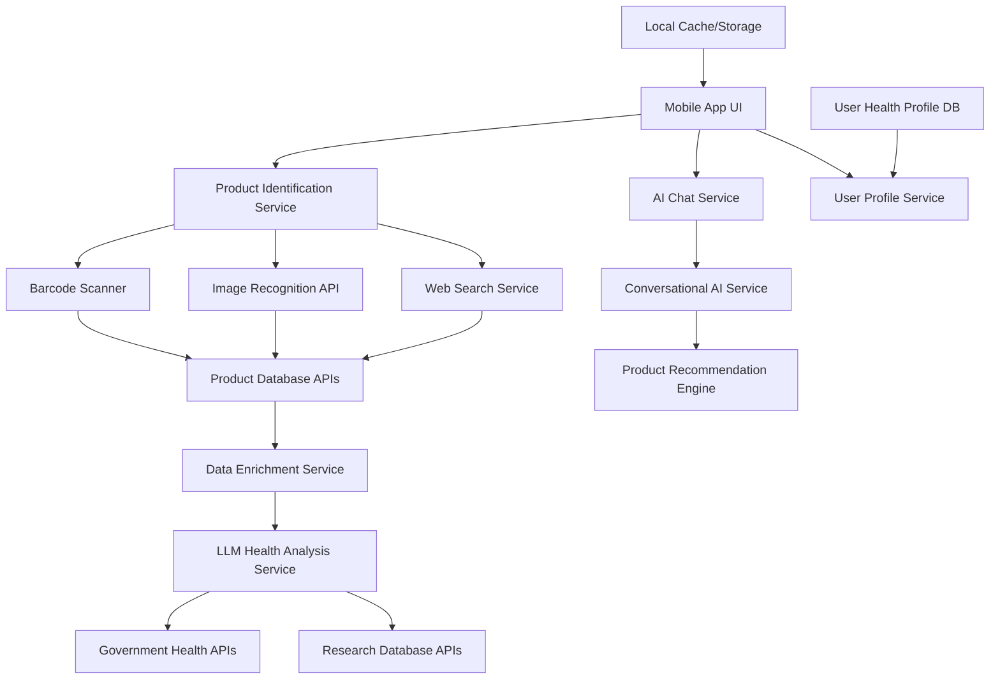

## High-Level Architecture

The Product Health Scanner follows a service-oriented architecture with clearly defined components that interact through well-defined interfaces. The system is designed to be modular, allowing for easy extension and maintenance.

## System Components

### Mobile Application Layer
The top layer consists of the React Native mobile application that provides the user interface. This layer handles user interactions, displays product information, shows health analysis results, and manages the chat interface.

### Service Layer
The service layer contains the business logic of the application, organized into distinct services:
- Product Identification Service
- Health Analysis Service
- Conversational AI Service
- User Profile Service
- Data Enrichment Service
- Scan History Service

### Data Layer
The data layer manages all data storage and retrieval:
- Local SQLite database for user profiles and scan history
- Caching layer for frequently accessed products
- Integration with external APIs for product and health data

### External Integrations
The system integrates with various external services:
- Open Food Facts API for product information
- OpenAI GPT-4 for health analysis and chat
- Google Vision API for image recognition
- Government health databases for authoritative information

## Data Flow

1. **Product Identification**: User initiates product identification through barcode scan, image capture, or text search
2. **Data Retrieval**: System retrieves basic product information from external databases
3. **Data Enrichment**: Product data is enriched with additional information from multiple sources
4. **Health Analysis**: Ingredients are analyzed against the user's health profile using AI
5. **Result Presentation**: Results are displayed to the user with warnings, benefits, and recommendations
6. **Interaction**: User can engage with the conversational AI for further information or alternatives

## Error Handling and Fallbacks

The architecture includes robust error handling with graceful degradation:
- If barcode scanning fails, the system falls back to image recognition
- If image recognition fails, the system offers text search
- If AI services are unavailable, the system provides basic allergen detection
- Offline mode allows access to previously scanned products

## Scalability Considerations

The modular architecture supports horizontal scaling:
- Services can be deployed independently
- Caching reduces load on external APIs
- Local storage enables offline functionality
- Load balancing can be implemented for high-traffic scenarios

## Security

The architecture incorporates several security measures:
- User health data is stored locally with encryption
- API keys are managed securely through environment variables
- Input validation prevents injection attacks
- Privacy controls allow users to manage data sharing preferences