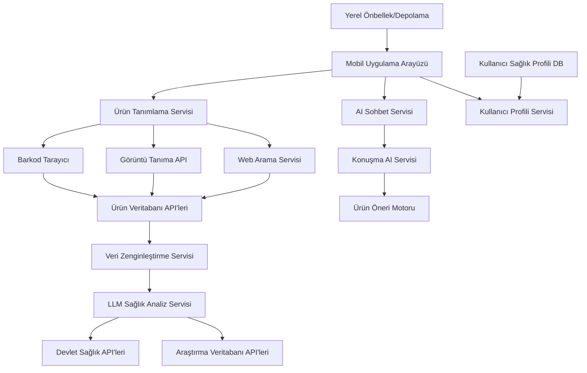

## Yüksek Seviyeli Mimari

Ürün Sağlık Tarayıcısı, açıkça tanımlanmış arayüzler aracılığıyla etkileşime geçen net olarak tanımlanmış bileşenlere sahip, servis odaklı bir mimari izler. Sistem modüler olacak şekilde tasarlanmıştır, bu da kolay genişletme ve bakım sağlar.

## Sistem Bileşenleri

### Mobil Uygulama Katmanı
En üst katman, kullanıcı arayüzünü sağlayan React Native mobil uygulamasını içerir. Bu katman kullanıcı etkileşimlerini yönetir, ürün bilgilerini gösterir, sağlık analiz sonuçlarını görüntüler ve sohbet arayüzünü yönetir.

### Servis Katmanı
Servis katmanı, ayrı servisler halinde organize edilen uygulamanın iş mantığını içerir:
- Ürün Tanımlama Servisi
- Sağlık Analiz Servisi
- Konuşma AI Servisi
- Kullanıcı Profili Servisi
- Veri Zenginleştirme Servisi
- Tarama Geçmişi Servisi

### Veri Katmanı
Veri katmanı tüm veri depolama ve alım işlemlerini yönetir:
- Kullanıcı profilleri ve tarama geçmişi için yerel SQLite veritabanı
- Sık erişilen ürünler için önbellekleme katmanı
- Ürün ve sağlık verileri için harici API'lerle entegrasyon

### Harici Entegrasyonlar
Sistem çeşitli harici servislerle entegre olur:
- Ürün bilgileri için Open Food Facts API
- Sağlık analizi ve sohbet için OpenAI GPT-4
- Görüntü tanıma için Google Vision API
- Yetkili bilgiler için devlet sağlık veritabanları

## Veri Akışı

1. **Ürün Tanımlama**: Kullanıcı barkod tarama, görüntü yakalama veya metin arama yoluyla ürün tanımlamayı başlatır
2. **Veri Alma**: Sistem temel ürün bilgilerini harici veritabanlarından alır
3. **Veri Zenginleştirme**: Ürün verileri birçok kaynaktan ek bilgilerle zenginleştirilir
4. **Sağlık Analizi**: İçerikler AI kullanılarak kullanıcının sağlık profiline göre analiz edilir
5. **Sonuç Sunumu**: Sonuçlar kullanıcıya uyarılar, faydalar ve önerilerle birlikte gösterilir
6. **Etkileşim**: Kullanıcı daha fazla bilgi veya alternatifler için konuşma AI'siyle etkileşime girebilir

## Hata İşleme ve Geri Dönüşler

Mimari, zarif bozulma ile sağlam hata işleme içerir:
- Barkod tarama başarısız olursa, sistem görüntü tanıma yöntemine geri döner
- Görüntü tanıma başarısız olursa, sistem metin arama sunar
- AI servisleri kullanılamazsa, sistem temel alerjen algılama sağlar
- Çevrimdışı mod, daha önce taranan ürünlere erişim sağlar

## Ölçeklenebilirlik Hususları

Modüler mimari yatay ölçeklemeyi destekler:
- Servisler bağımsız olarak dağıtılabilir
- Önbellekleme harici API'ler üzerindeki yükü azaltır
- Yerel depolama çevrimdışı işlevselliği sağlar
- Yük dengeleme yüksek trafikli senaryolar için uygulanabilir

## Güvenlik

Mimari birkaç güvenlik önlemi içerir:
- Kullanıcı sağlık verileri yerel olarak şifrelenmiş olarak saklanır
- API anahtarları ortam değişkenleri aracılığıyla güvenli şekilde yönetilir
- Girdi doğrulama enjeksiyon saldırılarını önler
- Gizlilik kontrolleri kullanıcıların veri paylaşımı tercihlerini yönetmesini sağlar